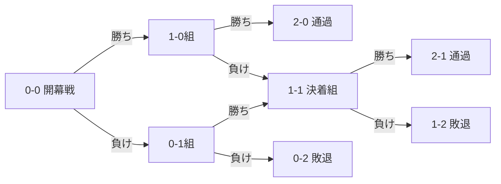
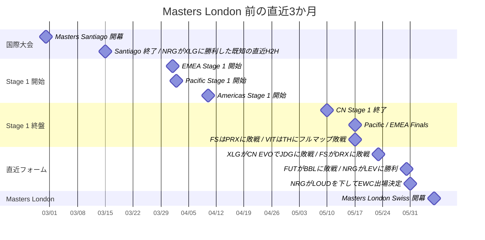

# VALORANT Masters London 2026 スイスステージ PICK'EMS予測レポート

## エグゼクティブサマリー

Masters London 2026 のSwiss Stageは、**8チームが参加し、2勝で突破・2敗で敗退**するBO3中心の短期決戦です。Riot公式の日本語大会概要では、各リーグのStage 1優勝チームがPlayoffsへ直行し、残る8チームがSwissを戦う形式が明示されています。公式Swissブラケット上で確定している開幕戦は、**XLG vs NRG / Team Vitality vs DRG / FULL SENSE vs FUT / Leviatán vs Global Esports**です。なお、公式日程はSwiss Day 1〜5と表記されていますが、公開済みブラケットの勝敗分岐は実質的に**開幕戦、1-0組、0-1組、1-1決着戦**の4ブロックで構成されています。したがって、本稿ではユーザー要望の「Round 1–5」を**Swiss Day 1–5**として扱い、Day 2以降はシナリオ分岐型で提示します。

本レポートの結論を先に述べると、**期待値重視のSwiss Pick'Em推奨は NRG / Team Vitality / Leviatán / FUT Esports の4通過、2-0ボーナス枠は NRG**です。独自Monte Carloでは、Swiss突破確率は **NRG 82.7%、Vitality 80.5%、Leviatán 60.8%、FUT 46.5%、FULL SENSE 42.8%、Global Esports 37.8%、XLG 30.5%、DRG 18.5%**となりました。最も悩ましい4枠目は **FUT と FULL SENSE の二択**で、市場オッズもサイト間で割れており、ここが最大のレバレッジポイントです。開幕戦単体では **NRG勝率 77.7%、Vitality 81.8%、FUT 52.1%、Leviatán 62.2%**を推奨値としました。これはRiot公式大会情報、VLRのリーグ成績・プレイヤースタッツ、bo3.ggのマップ傾向、公開オッズを総合したものです。

> [!NOTE]
> Swiss突破率の詳細な導出方法は[pick'ems-method](./pick'ems-method.md)を参照してください。

最重要な読み筋は三つです。第一に、**NRG と Vitality が最も“Swiss向き”**です。どちらも短期BO3で崩れにくいマップ深度と、直近の上位相手実績があります。第二に、**Leviatán は最終4強に最も近いが、直近EWC予選での失速があるため2-0固定より2-1通過が現実的**です。第三に、**FULL SENSE vs FUT がSwiss全体の分水嶺**で、ここをどちらに倒すかでその後の下位・1-1プールの組み合わせまで大きく変わります。primmieの爆発力を買うならFULL SENSE、ロンドン開催による移動優位と構造安定性を重く見るならFUTです。

## 大会の前提と大会環境

Riot公式の日本語記事によれば、Masters Londonには**Americas / Pacific / EMEA / CN の各Stage 1上位3チーム、計12チーム**が参加します。Stage 1優勝チームはPlayoffs直行で、Swissが免除されます。公式出場チーム一覧とSwissブラケットを突き合わせると、**Playoffs直行は G2 Esports / Paper Rex / Team Heretics / EDward Gaming**、Swiss出場は **Leviatán / NRG / FULL SENSE / Global Esports / Team Vitality / FUT Esports / XLG Esports / Dragon Ranger Gaming** です。

| 地域 | Playoffs直行 | Swiss出場 |
|---|---|---|
| Americas | G2 Esports | Leviatán, NRG |
| Pacific | Paper Rex | FULL SENSE, Global Esports |
| EMEA | Team Heretics | Team Vitality, FUT Esports |
| CN | EDward Gaming | XLG Esports, Dragon Ranger Gaming |

大会日程は、Swiss Stageが**6月6日〜10日**、Dark Dayが**6月11日**、Playoffsが**6月12日〜21日**です。日本語版公式記事ではSwiss Day 1〜5が並んでいますが、公開済みSwissブラケットは **Round 1 / Round 2（1-0側）/ Round 2（0-1側）/ Round 3（1-1決着）**の構造を示しています。このため、Day 5は現時点で独立した新規対戦ブロックとしては公開されていません。

上の図は、Riot公式のSwissルールをそのまま整理したものです。Pick'Emの観点では、**2-0ボーナス枠**が存在するため、単なる「4通過予想」ではなく、**最も2-0に近いチームを1つ選ぶ**ことが必要になります。Riotのパッチ12.10日本語ノートでも、Swiss Pick'Emは「8チームから上位進出チームを予想し、2-0通過チームを当てると追加ボーナス」と説明されています。

直近3か月の文脈も重要です。Masters Santiagoは**2月28日〜3月15日**、各地域のStage 1は**4月〜5月中旬〜下旬**に開催され、Master London開幕は**6月6日**です。Swiss出場チームの多くは、Stage 1終了後もEWC地域予選や中国の外部大会に出場しており、“強さ”だけでなく**直前の消耗度**も無視できません。特に、NRGとLeviatánは**5月30〜31日にEWC Americas予選**を戦っており、FUTは**5月30日にBBL戦**、FULL SENSEは**5月22〜23日にPacific予選**、XLGは**5月16〜18日にEWC China予選を抜けた後、5月23日にCN EVOでJDGと対戦**しています。

## データ基盤と予測モデル

本稿のインプットは、**Riot公式大会情報、日本語版パッチノート、VLRのStage 1 / Masters Santiagoスタッツ、VLRチームページの最近結果・スタッフ・Form Rating、bo3.ggの直近6か月マップ勝率とトランスファー履歴、公開オッズ**です。とくにVLRの「Player Performance and Stats」は、R 2.0、ACS、K/D、KAST、ADR、FKPRなど、いわゆるHLTV型の比較に最も使いやすい公開ページでした。

モデルは、外部の生レーティングをそのまま使うのではなく、**VLR Form Rating をElo/TrueSkill類似の外部強度指標**として採用し、そこに **直近3か月の勝敗経路、マップ相性、ロスター変更の新鮮さ、コーチ継続性、公開オッズの市場評価**を重ねて、最終的な**独自Power Index**へ変換しました。Swissシミュレーションは **200,000回のMonte Carlo** で、Round 1は公式固定カード、以降は同勝敗グループ内で**再戦禁止の有効ペアリングをランダム化**しています。数値は「絶対的な真値」ではなく、**6月2日時点の公開情報からの条件付き推定**です。 

パッチ前提は明示しておきます。6月2日時点で確認できる最新ライブパッチは**12.10**で、これはPick'Em追加と不具合修正が中心です。実際のメタを大きく動かしたのは**12.09**のNeon空中機動・Ultimate燃料・ショットガン移動精度調整、そして**12.08**の「Ascent IN / Bind OUT」のマップローテーション更新です。Riot公開ページ上ではLondon向けの別個のパッチロック表記を確認できなかったため、本稿では**大会は最新ライブ環境に近い前提**で読みますが、マップ勝率サンプルはbo3.ggの「直近6か月」を使っているため、**Bindや低サンプルAscent/Corrodeの数値は過信しない**方針です。

市場オッズは開幕戦の妥当性チェックにも使いました。公開ラインでは、**NRG対XLGはNRG優勢、VIT対DRGはVitality大幅優勢、LEV対GEはLeviatán中程度優勢**で概ね整合しています。一方で**FULL SENSE対FUTだけはサイト間で評価が大きく割れており**、Game-TournamentsではFULL SENSEがわずかに上、bo3.ggではFUTがわずかに上という、実質コイントスに近い状況でした。ここは市場もコンセンサス未成立と見てよく、このシリーズをどう置くかがPick'Em差別化の最大ポイントです。

## スイス進出8チームの比較

以下の表は、Swiss出場8チームを**VLRの公開Rating、直近結果、マップ傾向、主要プレイヤー/ロスター情報**で横並びにしたものです。VLR Ratingは外部のElo系シグナル、右端のPower Indexは本稿の合成値です。直近結果の時間窓は概ね**Masters Santiago終了後〜London開幕前**を重視しています。

| Team | VLR Rating | 直近シグナル | 主要マップ傾向 | 主な不安点 | Key Player / 補足 | Power Index | 根拠 |
|---|---:|---|---|---|---|---:|---|
| NRG | 1970 | G2に2-3後、FURIA/LEV/LOUDを連破してEWC通過 | Haven 89%, Lotus 75%, Pearl 69% | Split 25%, Corrode 33% | brawk: R2.0 1.24 / ACS 225.4 / K:D 1.28 | 100 | VLR/bo3 |
| Team Vitality | 1879 | EMEA準優勝。THにGrand Final 2-3の高水準 | Corrode 100%, Pearl 83%, Haven 67% | Ascent 0%, Split 43% | Sayonara: R2.0 1.13 / ACS 222.3 / K:D 1.17 | 98 | VLR/bo3 |
| Leviatán | 1760 | Americas準優勝だが直後にMIBR/NRGへ連敗 | Ascent 75%, Bind 71%, Split 60% | Breeze 0%, Lotus 0% | Neon: R2.0 1.25 / ACS 226.6 / K:D 1.45 | 92 | VLR/bo3 |
| FUT Esports | 1744 | NAVIに勝利後、M8/BBLに敗戦。3月末〜4月頭に改編 | Bind 86%, Corrode 75%, Haven 60% | Pearl 25%, Breeze 33% | sociablee加入 4/1、s0pp加入 3/28、Bambino/Vlad体制 | 88 | VLR/bo3 |
| FULL SENSE | 1844 | Pacific準優勝後、Gen.G/DRXに連敗 | Pearl 78%, Lotus 75%, Split 60% | Abyss 0%, Breeze 20% | primmie: R2.0 1.24 / ACS 265.4 / K:D 1.31 | 87 | VLR/bo3 |
| Global Esports | 1887 | PRX撃破歴あり。EWC Pacific予選でも上位通過 | Abyss 100%, Pearl 67%, Haven 67%, Breeze 63% | Ascent 0%, Corrode 0% | FrosT体制。PatMen/Kr1stal/UdoTan軸 | 86 | VLR/bo3 |
| XLG Esports | 1833 | China準優勝。EWC China予選通過後にJDGへ敗戦 | Bind 100%, Lotus 71%, Pearl 57% | Abyss 40%, Breeze 44% | happywei: R2.0 1.14 / ACS 232.5 / K:D 1.19 | 85 | VLR/bo3 |
| DRG | 1667 | China 3位。ロンドン線上では最も不安定 | Lotus 63%, Ascent 100%* | Abyss 0%, Split 33%, Breeze 25% | vo0kashu: R2.0 1.25 / ACS 220.2 / K:D 1.26 | 80 | VLR/bo3 |

\* Ascent はサンプル1で低信頼です。bo3.ggの6か月集計はローテ変更前後を含むため、特に低サンプルマップは補助情報として扱っています。

個人火力では、公開リーグ統計で明確に頭ひとつ抜けているのが**FULL SENSE の primmie**です。Pacific Stage 1で **ACS 265.4、K/D 1.31、FKPR 0.20** は、Swiss全体で見ても“1人で試合を壊せる”数字です。**Leviatán の Neon**も **R2.0 1.25、K/D 1.45** と終盤の取り切り能力が非常に高く、**NRG の brawk**は **APR 0.41、KAST 79%** で支援役として異様に高い安定値を出しています。**XLG の happywei**、**DRG の vo0kashu**、**Vitality の Sayonara**も、それぞれの地域でトップ級のキャリー指標でした。

一方で、**FUT と GE は今回取得できたテキスト版ソースでは、ロスター/スタッフ/マップ統計の抽出が安定していた反面、直近大会の完全な個人別ACS/K/D一覧は表形式で安定抽出できませんでした**。そのため両チームは、**マップ傾向・最近結果・ロスター継続性・市場評価**の比重を上げています。これは情報欠損であり、モデル不確実性の主因の一つです。

コーチ陣とチーム構造も小さくありません。公開チームページ上で戦術継続性がはっきり読み取れるのは、**NRGの bonkar、Leviatán の Jhein + Onur、Global Esports の FrosT、FUT の Bambino + Vlad、EDward Gaming の Autumn、Paper Rex の alecks**です。Swiss参加チームに限ると、**NRG・LEV・GE・FUT はコーチラインの見通しが比較的良く、短期調整局面でプラス評価**と見ました。逆に、FS と DRG はロスター変更の日付が比較的新しく、噛み合い切った時の上振れはある一方、BO3の数ラウンド単位で事故る確率も高いと見ています。

移動・疲労の観点では、地域最終戦の開催地が **Los Angeles / Berlin / Ho Chi Minh City / Hangzhou**、本大会が **London** です。さらに、Swiss参加チームの一部は5月下旬までEWC地域予選や外部大会を消化していました。とくに**NRGとLeviatánは5月31日まで実戦、FUTは5月30日、FULL SENSEは5月23日、XLGは5月23日、GEもPacific予選を挟んでの渡英**で、体内時計と準備時間の両面から軽いマイナスを与えています。対照的に、**Vitality は少なくとも取得済み公開結果上は5月17日のEMEA Grand Finalから相対的に長い調整期間**を持っており、これはSwiss適性を押し上げる要素です。

## 対戦別勝率とスイス最終形予測

Round 1のH2H文脈は比較的明快です。VLRのドロー記事によると、**VIT-DRG、FS-FUT、LEV-GEは初対戦**で、**XLG-NRGのみが過去に1度だけ対戦しており、Masters Santiago SwissでNRGが勝利**しています。つまり、開幕戦では「実戦H2Hの蓄積」よりも、**地域内の直近完成度とマップ相性**を重く見るべきです。

以下のRound 1表は、**市場ライン**と**本稿モデル**を並べたものです。市場値は複数サイトで液状性が不均一なため、厳密なコンセンサスではなく「公開確認レンジ」として扱っています。 

| Round 1 | 公開市場レンジ | 本稿モデル | 信頼度 | 推奨 |
|---|---:|---:|---|---|
| NRG vs XLG | NRG 約72〜79% | **NRG 77.7%** | 高 | **NRG** |
| Team Vitality vs DRG | VIT 約80〜87% | **VIT 81.8%** | 高 | **Team Vitality** |
| FULL SENSE vs FUT | ほぼ拮抗、サイト割れ | **FUT 52.1%** | 低 | **FUT** |
| Leviatán vs Global Esports | LEV 約62〜64% | **LEV 62.2%** | 中 | **Leviatán** |

開幕戦の読みを文章で詰めると、**NRG vs XLG** は NRG の方が “Swissで負けにくい” 形をしています。直近EWC予選でLEVとLOUDを倒した熱量に加え、Haven/Lotus/Pearlの安定度が高く、XLG側の主戦級に対しても撃ち合い負けしにくい構造です。XLGは Lotus で返せるものの、シリーズ全体では NRG の方がマップ深度と対国際戦経験で一段上と見ます。

**Vitality vs DRG** は、Swiss全体でもっとも“素直に取りにいきやすい”カードです。Vitalityは EMEA準優勝かつ Sayonara の基礎火力が高く、Pearl/Haven/Corrode で大崩れしません。DRGは Lotus を通せれば勝機がありますが、Abyss 0%、Split 33%、Breeze 25%、Pearl 25% のマップ形状はBO3で苦しく、低サンプルAscent一本では補えません。

**FULL SENSE vs FUT** はこの大会で最も難しい初戦です。FULL SENSE側には primmie の天井と Pearl/Lotus の鋭さがありますが、Pacific Final後に Gen.G / DRX へ連敗しており、Abyss/Breeze が深刻です。FUTは 3月末〜4月頭の補強で別チーム化しており、Bind/Corrode/Haven に強みがある一方、Pearl が 25% と明確な穴です。もし実戦マッププールで Bind の価値が薄まるなら FS 寄り、ロンドン環境への適応・休養面を重く見るなら FUT 寄りです。本稿は**ごく薄く FUT**に倒しましたが、ここは本当に低信頼です。

**Leviatán vs Global Esports** は、数字だけ見ると誤差帯に見えて、実戦の印象はやや LEV 有利です。GEは Abyss/Pearl/Breeze に明確な勝ち筋があり、PRX撃破歴もありますが、LEVIATÁN は Neon のキャリー力に加え、Ascent/Bind/Split/Haven でGEより“普通に勝ちやすい地形”が多い。GEがAbyss/Breeze 系列へシリーズを寄せられれば upset の余地は十分ありますが、標準的なBO3では LEV 側の基礎期待値が上です。

未来ラウンドは公式未確定なので、ここからは**Swissシミュレーション上の「最も起きやすい対戦」**を示します。発生率は「そのラウンドブロックでその対戦が起きる確率」、勝率は「その対戦が発生した場合の条件付き勝率」です。

| 予測ブロック | 起きやすい対戦 | 発生率 | 条件付き勝率 | 推奨 |
|---|---|---:|---:|---|
| 1-0組 | NRG vs Team Vitality | 21.2% | NRG 54.2% | NRG |
| 1-0組 | Leviatán vs Team Vitality | 17.1% | VIT 62.2% | VIT |
| 1-0組 | Leviatán vs NRG | 16.1% | NRG 66.1% | NRG |
| 1-0組 | FUT vs Team Vitality | 14.2% | VIT 69.7% | VIT |
| 0-1組 | DRG vs XLG | 21.2% | XLG 60.3% | XLG |
| 0-1組 | DRG vs Global Esports | 17.0% | GE 62.2% | GE |
| 0-1組 | Global Esports vs XLG | 16.1% | GE 52.1% | GE |
| 0-1組 | DRG vs FULL SENSE | 14.2% | FS 64.2% | FS |
| 1-1決着戦 | FUT vs Leviatán | 11.9% | LEV 58.3% | LEV |
| 1-1決着戦 | FULL SENSE vs Leviatán | 11.8% | LEV 60.3% | LEV |
| 1-1決着戦 | FUT vs Global Esports | 11.4% | FUT 54.2% | FUT |
| 1-1決着戦 | FULL SENSE vs Global Esports | 11.3% | FS 52.1% | FS |

この表から見えるのは、**Swiss中盤の主導権は NRG / VIT / LEV の3チームが握りやすい**こと、そして **FUT / FS / GE / XLG の4チームが残り1枠〜2枠を争う構図**だという点です。DRGは多くの分岐で“相手の復調材料”になってしまっており、0-1組で最もフェードしやすいチームです。逆に GE は開幕戦で負けても 0-1組の相手関係が比較的軽く、**開幕戦負けからの2-1滑り込み**がまだ見えるチームです。 

最終的なSwissレコード予測は次の通りです。ここでは **「最頻値」**と **「突破確率」**を分けて見てください。FUTのように、**最も起きやすい単一レコードは1-2でも、突破確率では4番手**というチームが存在します。これは分布が広い、つまり上振れ・下振れの両方が大きいことを意味します。

| Team | 2-0 | 2-1 | 1-2 | 0-2 | Swiss突破率 | 最頻レコード | 判断 |
|---|---:|---:|---:|---:|---:|---|---|
| NRG | 52.5% | 30.2% | 11.8% | 5.6% | **82.7%** | 2-0 | 最有力 |
| Team Vitality | 51.5% | 29.0% | 13.9% | 5.6% | **80.5%** | 2-0 | 最有力 |
| Leviatán | 29.9% | 30.8% | 24.5% | 14.8% | **60.8%** | 2-1 | 有力 |
| FUT Esports | 20.3% | 26.2% | 31.0% | 22.5% | **46.5%** | 1-2 | 4番手 |
| FULL SENSE | 17.9% | 25.0% | 31.7% | 25.5% | **42.8%** | 1-2 | 5番手、上振れ枠 |
| Global Esports | 13.9% | 23.8% | 30.7% | 31.5% | **37.8%** | 0-2 | ダークホース |
| XLG Esports | 8.6% | 21.9% | 28.7% | 40.8% | **30.5%** | 0-2 | upset待ち |
| DRG | 5.4% | 13.1% | 27.8% | 53.8% | **18.5%** | 0-2 | フェード候補 |

12チーム全体で整理すると、**G2 / Paper Rex / Team Heretics / EDward Gaming はSwiss免除**で、Swiss予測対象は上の8チームです。したがって「全チームの最終Swiss record prediction」は以下のように要約できます。 

| Team | 進入ステージ | 予測 |
|---|---|---|
| G2 Esports | Playoffs直行 | Swiss免除 |
| Paper Rex | Playoffs直行 | Swiss免除 |
| Team Heretics | Playoffs直行 | Swiss免除 |
| EDward Gaming | Playoffs直行 | Swiss免除 |
| NRG | Swiss | 2-0 最頻 |
| Team Vitality | Swiss | 2-0 最頻 |
| Leviatán | Swiss | 2-1 最頻 |
| FUT Esports | Swiss | 1-2 最頻だが突破4番手 |
| FULL SENSE | Swiss | 1-2 最頻 |
| Global Esports | Swiss | 0-2 最頻 |
| XLG Esports | Swiss | 0-2 最頻 |
| DRG | Swiss | 0-2 最頻 |

## 推奨PICK'EMS

Pick'Emとして最も素直なのは、**突破4枠を NRG / Team Vitality / Leviatán / FUT Esports、2-0ボーナスを NRG** に置く形です。理由は単純で、突破率上位4チームをそのまま取れており、2-0率も NRG が最上位だからです。Vitality を 2-0 ボーナスにする手もありますが、モデル差は **NRG 52.5% vs VIT 51.5%** と僅差です。一般的な知名度を考えると NRG の方が人気化しやすい一方、純確率の差はほぼないため、**ユニークネス重視なら VIT を2-0にする逆張りは成立**します。 

より実戦的に言うと、**安全寄り**なら  
**通過:** NRG / VIT / LEV / FUT  
**2-0:** NRG  

**バランス型**なら  
**通過:** NRG / VIT / LEV / FULL SENSE  
**2-0:** NRG  

**差別化重視**なら  
**通過:** NRG / VIT / LEV / GE  
**2-0:** VIT  

という3パターンが現実的です。FULL SENSE型は prmmie の爆発を買う形、GE型は Pacific のAbyss/Breeze系メタが強く出る前提のハイリスク案です。

Swiss Day 1–5 の“使える判断ルール”を、現時点の公開ブラケットに合わせて整理すると次のようになります。

| Swiss Day | 公式状態 | 推奨アクション | 信頼度 |
|---|---|---|---|
| Day 1 | 開幕戦確定 | **NRG / VIT / FUT / LEV** を取る | 高 / 高 / 低 / 中 |
| Day 2 | 1-0組 | **NRG は誰相手でも基本取り**。**VIT は NRG 以外なら優先**。LEVはFUT/FS/GE相手なら取りやすい | 中 |
| Day 3 | 0-1組 | **DRGを広くフェード**。XLG > DRG、GE > DRG、FS > DRG、FUT > DRG を優先 | 中 |
| Day 4 | 1-1決着戦 | **VIT か LEV が残っていたら優先**。FUT/FS/GE/XLGだけの決着は着差が最小 | 低〜中 |
| Day 5 | Swiss期間内だが独立新規ブロック未公表 | 追加の“新ラウンド読み”より、**前日までの生存構造を優先**。UIが通過予想なら基準セットを維持 | 情報扱い |

ここで重要なのは、**“毎ラウンドで無理に upset を作らない”**ことです。Swissは短期戦なので、1つの読み違いがその後のカード全体を変えます。今回の構造だと、**VIT と NRG のどちらかを early loss に置くと、その後の 1-1 / 0-1 プールが大きく歪んで EV が落ちやすい**。逆に、**4枠目だけを FUT / FS / GE で差別化する**のは合理的です。 

代替シナリオも整理しておきます。まず **Pacific上振れシナリオ**では、FULL SENSE と GE の突破率がそれぞれ大きく上がります。これは prmmie の火力、GEのAbyss/Pearl/Breeze優位、そして Pacific勢がロンドン到着後すぐにアグロ環境へ適応した場合に起こりやすい分岐です。逆に **市場追従の保守シナリオ**では、NRG / VIT / LEV / FUT がより固くなり、FS と GE は明確に下がります。つまり、4枠目は「予想の上手さ」より **どちらの大会観を持つか** の問題です。私は現時点では、**FUT をわずかに前**に置きます。理由は、ロンドン開催による環境適応のしやすさと、FUT 側のマップ深度が Swiss の“2勝先取BO3”にまだ噛み合いやすいからです。

最終結論を一行でまとめるなら、**最適解は「NRG 2-0、通過は NRG / VIT / LEV / FUT」、最も大きい勝負所は「FULL SENSE を FUT に替えて刺しにいくかどうか」**です。Riot公式フォーマット上、Swissは母数が小さく、1シリーズの誤差が大きく増幅されます。だからこそ、**高信頼の2本（NRG・VIT）を固定し、LEVを準固定、4本目だけで個性を出す**のが最も再現性の高いPick'Em戦略だと考えます。
