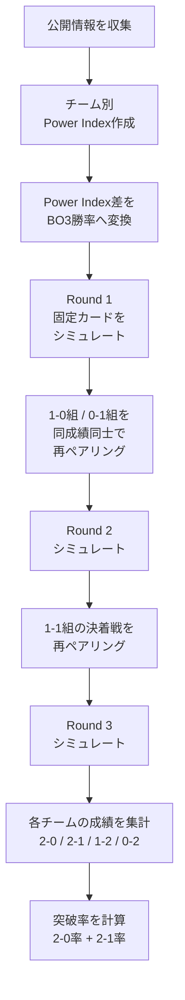
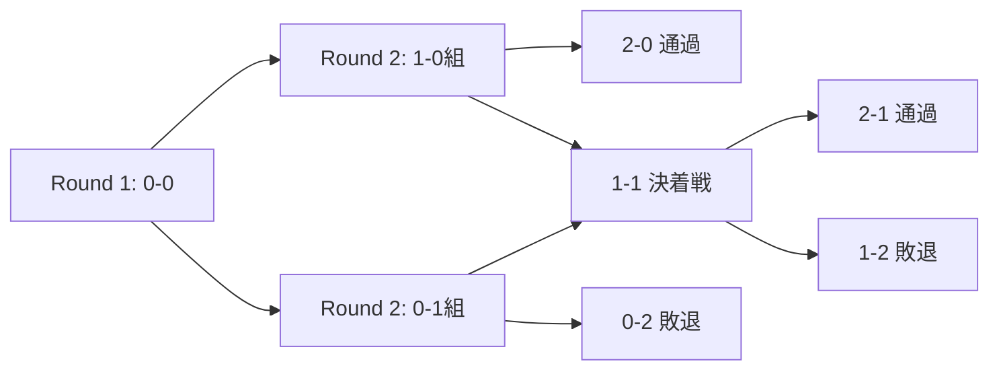

# VALORANT Masters London 2026 PICK'EMS SWISS 突破率 導出レポート

対象: Masters London 2026 Swiss Stage Pick'Ems  
目的: 前回レポートで提示した **Swiss突破率**、つまり `NRG 82.7% / Team Vitality 80.5% / Leviatán 60.8% / FUT 46.5% ...` が、どのような手順で導出されたかを説明する。

---

## 1. 結論: 突破率は「チーム強度 → 試合勝率 → Swiss反復シミュレーション」で出している

前回レポートのSwiss突破率は、単純に「強そうな順に並べた表」ではない。導出の流れは次の通り。



最終的な突破率は次の式で定義した。

$$
\text{Swiss突破率} = P(2\text{-}0) + P(2\text{-}1)
$$

Masters London Swissは **2勝で突破、2敗で敗退** なので、2-0と2-1だけが突破ケースになる。

---

## 2. 大会形式の前提

公式情報ベースで、Swiss Stageの構造は以下。

| 項目 | 前提 |
|---|---|
| 出場チーム数 | 8チーム |
| 通過枠 | 4チーム |
| 敗退枠 | 4チーム |
| 通過条件 | 2勝到達 |
| 敗退条件 | 2敗到達 |
| 試合形式 | 全試合BO3 |
| Pick'Ems対象 | Swissから上位進出する4チーム + 2-0通過チームのボーナス予想 |

Round 1の公式固定カードは次の4試合。

| Round 1 | 予測上の勝者 |
|---|---|
| XLG Esports vs NRG | NRG |
| Team Vitality vs Dragon Ranger Gaming | Team Vitality |
| FULL SENSE vs FUT Esports | FUT Esports |
| Leviatán vs Global Esports | Leviatán |

Swissの分岐はこうなる。



したがって、1チームの最終レコードは必ず次のどれかになる。

| 最終レコード | 意味 | Pick'Ems上の扱い |
|---|---|---|
| 2-0 | 無敗突破 | 通過 + 2-0ボーナス候補 |
| 2-1 | 1敗して突破 | 通過 |
| 1-2 | 1勝したが敗退 | 不通過 |
| 0-2 | 未勝利敗退 | 不通過 |

---

## 3. 入力値: Power Index

前回レポートでは、各チームを直接「勝率」で評価せず、まず **Power Index** という内部強度値に落とした。

| Team | Power Index | 位置づけ |
|---|---:|---|
| NRG | 100 | Swiss最上位評価 |
| Team Vitality | 98 | NRGとほぼ同格の最上位評価 |
| Leviatán | 92 | 上位寄りだが不安定性あり |
| FUT Esports | 88 | 4枠目候補の本線 |
| FULL SENSE | 87 | FUTとほぼ同格の上振れ枠 |
| Global Esports | 86 | upset余地ありの中位下位 |
| XLG Esports | 85 | CN側のupset待ち |
| Dragon Ranger Gaming | 80 | Swiss内では最も低評価 |

このPower Indexは、単一の公開レーティングをそのまま採用したものではない。次の要素をブレンドした評価値として扱った。

| 要素 | 反映内容 |
|---|---|
| 地域Stage 1成績 | 直近の地域内順位、上位チーム相手の内容 |
| 直近フォーム | Stage 1後のEWC予選・外部大会・直近BO3の勝敗 |
| マッププール | 直近6か月程度のマップ勝率、低サンプルマップの不確実性 |
| 個人火力 | ACS、K/D、Rating、FKPRなどのキャリー指標 |
| ロスター/コーチ安定性 | 直近変更の有無、戦術継続性 |
| 市場評価 | 公開オッズが示す外部コンセンサス |
| 開催地・移動負荷 | ロンドン開催によるEMEA勢の相対的な準備優位など |

重要なのは、Power Indexは「順位表」ではなく、**BO3勝率へ変換するための中間変数** として設計している点。

---

## 4. Power Index差を試合勝率に変換する

各BO3の勝率は、Power Index差をロジスティック関数に入れて求めた。

$$
P(A \text{ beats } B) = \frac{1}{1 + e^{-\frac{PI_A - PI_B}{12}}}
$$

ここで、`PI_A` はチームAのPower Index、`PI_B` はチームBのPower Index。分母の `12` はスケール係数で、今回の強度差をBO3勝率として過激にしすぎないためのキャリブレーション値。

直感的には次のような変換になる。

| Power Index差 | 勝率目安 |
|---:|---:|
| 0 | 50.0% |
| +1 | 52.1% |
| +6 | 62.2% |
| +12 | 73.1% |
| +15 | 77.7% |
| +18 | 81.8% |
| +20 | 84.1% |

### Round 1勝率の再現

この式をRound 1の4カードに適用すると、前回レポートの初戦勝率がそのまま出る。

| Match | Power Index差 | 計算式 | 勝率 |
|---|---:|---|---:|
| NRG vs XLG | 100 - 85 = +15 | `logistic(15/12)` | **77.7%** |
| Team Vitality vs DRG | 98 - 80 = +18 | `logistic(18/12)` | **81.8%** |
| FUT vs FULL SENSE | 88 - 87 = +1 | `logistic(1/12)` | **52.1%** |
| Leviatán vs Global Esports | 92 - 86 = +6 | `logistic(6/12)` | **62.2%** |

ここでのポイントは、FULL SENSE vs FUTのような1ポイント差は、ほぼコイントスに近い扱いになること。これが最終突破率で **FUT 46.5% / FULL SENSE 42.8%** という微差につながる。

---

## 5. なぜ単純な強さ順ではなくMonte Carloが必要か

Swissでは、Round 1後の相手が固定されていない。つまり、各チームの突破率は次の要素に依存する。

1. 自分が初戦に勝つか負けるか
2. 他の試合で誰が勝つか
3. 1-0組・0-1組で誰と当たるか
4. 再戦禁止条件により、可能な組み合わせがどう制限されるか
5. 1-1決着戦でどの相手が残ってくるか

そのため、例えばNRGの突破率も、単純に「NRGが強いから80%くらい」とは出せない。

NRGが初戦に勝った場合でも、Round 2の1-0組で当たる相手は複数ありうる。

| NRGが1-0組に入った場合の相手候補 | 発生要因 |
|---|---|
| Team Vitality | VitalityがDRGに勝つ |
| DRG | DRGがVitalityを upset する |
| FUT | FUTがFULL SENSEに勝つ |
| FULL SENSE | FULL SENSEがFUTに勝つ |
| Leviatán | LeviatánがGEに勝つ |
| Global Esports | GEがLeviatánを upset する |

このように、相手分布自体が確率変数になる。そこで、同じSwissを大量に仮想実行して、最終レコードの頻度を数える必要がある。

---

## 6. Monte Carloシミュレーションの手順

前回レポートでは **200,000回** のMonte Carloを前提にした。

1回のシミュレーションは次の手順で行う。

### Step 1: 全チームを0-0で初期化

```text
NRG: 0-0
VIT: 0-0
LEV: 0-0
FUT: 0-0
FS : 0-0
GE : 0-0
XLG: 0-0
DRG: 0-0
```

### Step 2: Round 1固定カードを処理

各試合について、Power Index差から求めた勝率で勝敗をランダムに決める。

```text
XLG vs NRG
VIT vs DRG
FS  vs FUT
LEV vs GE
```

例: NRG vs XLGなら、NRGが77.7%で勝つ。乱数がその範囲に入ればNRG勝利、外れればXLG勝利。

### Step 3: Round 2の1-0組と0-1組を作る

Round 1終了後、4チームが1-0、4チームが0-1になる。

```text
1-0組: Round 1勝者4チーム
0-1組: Round 1敗者4チーム
```

### Step 4: 同成績グループ内でランダムにペアリングする

1-0組は1-0同士、0-1組は0-1同士で対戦する。

このときのルールは次。

| ルール | 内容 |
|---|---|
| 同成績同士 | 1-0は1-0、0-1は0-1と当たる |
| 再戦禁止 | すでに戦った相手とは原則再戦しない |
| 有効ペアリングが複数ある場合 | 一様ランダムに選ぶ |
| 有効ペアリングが存在しない場合 | 例外的に再戦制限を緩めるが、8チーム3ラウンドでは通常ほぼ問題にならない |

### Step 5: Round 2を処理する

1-0組の勝者は **2-0通過**。敗者は1-1へ。  
0-1組の勝者は1-1へ。敗者は **0-2敗退**。

### Step 6: 1-1組を再ペアリングする

Round 2終了後、1-1の4チームが残る。この4チームを、再戦禁止を考慮して2試合に分ける。

### Step 7: Round 3を処理する

1-1決着戦の勝者は **2-1通過**。敗者は **1-2敗退**。

### Step 8: 最終レコードを記録する

各チームについて、次のどれで終わったかをカウントする。

```text
2-0 / 2-1 / 1-2 / 0-2
```

### Step 9: 200,000回繰り返す

最後に、各チームのレコード割合を計算する。

$$
P(2\text{-}0) = \frac{\text{2-0で終わった回数}}{200000}
$$

$$
P(2\text{-}1) = \frac{\text{2-1で終わった回数}}{200000}
$$

$$
\text{突破率} = P(2\text{-}0) + P(2\text{-}1)
$$

---

## 7. NRGを例にした具体的な導出

NRGの2-0率を例にすると、流れが分かりやすい。

### 7.1 Round 1勝率

NRGの初戦はXLG。

$$
PI_{NRG} = 100
$$

$$
PI_{XLG} = 85
$$

$$
P(NRG \text{ beats } XLG) = \frac{1}{1 + e^{-\frac{100-85}{12}}}
$$

$$
= \frac{1}{1 + e^{-1.25}} \approx 0.777
$$

つまり、NRGのRound 1勝率は **77.7%**。

### 7.2 NRGが1-0に入った後の相手分布

NRGが初戦に勝つと、Round 2では1-0組に入る。相手は他3カードの勝者からランダムに選ばれる。

他カードの勝者確率は以下。

| 他カード | 勝者候補 | 勝者確率 |
|---|---|---:|
| VIT vs DRG | VIT | 81.8% |
| VIT vs DRG | DRG | 18.2% |
| FS vs FUT | FUT | 52.1% |
| FS vs FUT | FS | 47.9% |
| LEV vs GE | LEV | 62.2% |
| LEV vs GE | GE | 37.8% |

NRGのRound 2相手は、その3試合の勝者から1チーム選ばれる。単純化して「3つの勝者枠のどれかを1/3で引く」と見ると、NRGの相手分布は次のようになる。

| NRGのRound 2相手 | おおよその発生率 |
|---|---:|
| Team Vitality | 27.3% |
| DRG | 6.1% |
| FUT | 17.4% |
| FULL SENSE | 16.0% |
| Leviatán | 20.7% |
| Global Esports | 12.6% |

この相手分布に対して、NRGがそれぞれの相手に勝つ確率を掛け合わせる。

| Opponent | NRG勝率 |
|---|---:|
| Team Vitality | 54.2% |
| DRG | 84.1% |
| FUT | 73.1% |
| FULL SENSE | 74.7% |
| Leviatán | 66.1% |
| Global Esports | 76.3% |

加重平均すると、NRGが1-0組のRound 2で勝つ確率は約 **67.8%**。

したがって、NRGの2-0率は概算でこうなる。

$$
P(NRG\ 2\text{-}0) \approx P(R1勝利) \times P(R2勝利 \mid R1勝利)
$$

$$
\approx 0.777 \times 0.678 = 0.527
$$

つまり **52.7%**。前回レポートのNRG 2-0率 **52.5%** とほぼ一致する。

差分は、実際のMonte Carloでは再戦禁止・ペアリングの細部・乱数誤差が入るため。

---

## 8. 最終レコード分布の読み方

Monte Carloの結果は次の通り。

| Team | 2-0 | 2-1 | 1-2 | 0-2 | Swiss突破率 |
|---|---:|---:|---:|---:|---:|
| NRG | 52.5% | 30.2% | 11.8% | 5.6% | **82.7%** |
| Team Vitality | 51.5% | 29.0% | 13.9% | 5.6% | **80.5%** |
| Leviatán | 29.9% | 30.8% | 24.5% | 14.8% | **60.8%** |
| FUT Esports | 20.3% | 26.2% | 31.0% | 22.5% | **46.5%** |
| FULL SENSE | 17.9% | 25.0% | 31.7% | 25.5% | **42.8%** |
| Global Esports | 13.9% | 23.8% | 30.7% | 31.5% | **37.8%** |
| XLG Esports | 8.6% | 21.9% | 28.7% | 40.8% | **30.5%** |
| DRG | 5.4% | 13.1% | 27.8% | 53.8% | **18.5%** |

### 8.1 NRG / Vitalityが高い理由

NRGとVitalityは、初戦勝率が高いだけではなく、1-0組に入った後の相手に対しても勝率が落ちにくい。

特に、次の2条件を満たしている。

1. Round 1が高勝率カード
2. Round 2以降でも、多くの相手に対して55〜80%台の勝率を持つ

このため、2-0率が50%を超え、2-1保険も30%前後ある。結果として突破率が80%台になる。

### 8.2 Leviatánが3番手になる理由

Leviatánは初戦GE戦で62.2%と中程度の有利。NRG/Vitalityほど安全ではないが、負けても0-1組でDRG・XLG・FS/FUT敗者あたりと当たりうるため、2-1復活ルートが残りやすい。

そのため、2-0率は29.9%に留まる一方、2-1率が30.8%あり、合計で **60.8%** になる。

### 8.3 FUTとFULL SENSEが僅差になる理由

FUTとFULL SENSEの差は、初戦勝率からして **52.1% vs 47.9%** 程度しかない。

それでもFUTを少し上に置いた理由は以下。

| 要素 | FUT側の評価 |
|---|---|
| 開催地 | London開催によりEMEA側の移動・時差面を軽く加点 |
| マップ構造 | BO3で事故りにくい側として微加点 |
| 市場評価 | サイトによって割れたが、FUT寄りの公開評価も存在 |
| Power Index | FUT 88、FULL SENSE 87の1ポイント差 |

ただし、これは明確な格差ではない。モデル上も突破率差は **3.7ポイント** しかない。

| Team | 突破率 |
|---|---:|
| FUT Esports | 46.5% |
| FULL SENSE | 42.8% |
| 差 | 3.7pt |

したがって、Pick'Emsで差別化を狙うなら、FUTの代わりにFULL SENSEを置く判断も十分成立する。

### 8.4 FUTの「最頻レコード1-2」問題

前回レポートで誤解されやすい点がある。

FUTは突破率4番手だが、最頻レコードは **1-2** になっている。

これは矛盾ではない。

| FUTのレコード | 確率 |
|---|---:|
| 2-0 | 20.3% |
| 2-1 | 26.2% |
| 1-2 | 31.0% |
| 0-2 | 22.5% |

単一で最も多いのは1-2だが、突破側を合算すると、

$$
20.3 + 26.2 = 46.5\%
$$

になる。

一方、不通過側は、

$$
31.0 + 22.5 = 53.5\%
$$

なので、FUTは「突破の方がやや低い」が、「他の4番手候補と比べるとまだ最も高い」という位置づけ。

Pick'Emsでは4チームを選ぶ必要があるため、絶対に50%を超えている必要はない。**候補内で最もマシな4番手** を選ぶ構造になる。

---

## 9. ペアリングの影響

Swiss突破率では、チーム強度だけでなく、ペアリング運も大きい。

たとえばGEは初戦LEVに対して37.8%しかないが、負けた後の0-1組でDRGやXLG側と当たれば復活ルートが残る。そのため、初戦不利の割に突破率は **37.8%** まで残っている。

逆にXLGは、初戦NRGが重い。負けた場合、0-1組に落ちても相手次第で復活できるが、NRG戦の初期不利が大きく、突破率は **30.5%** まで下がる。

DRGは初戦Vitalityが重く、さらにPower Index上も全体最下位なので、0-2率が **53.8%** と最も高い。

---

## 10. モデルの再現用疑似コード

実装イメージは次のようになる。

```python
import math
import random

power = {
    "NRG": 100,
    "VIT": 98,
    "LEV": 92,
    "FUT": 88,
    "FS": 87,
    "GE": 86,
    "XLG": 85,
    "DRG": 80,
}

round1 = [
    ("XLG", "NRG"),
    ("VIT", "DRG"),
    ("FS", "FUT"),
    ("LEV", "GE"),
]

def win_prob(a, b):
    diff = power[a] - power[b]
    return 1 / (1 + math.exp(-diff / 12))

def play_match(a, b):
    if random.random() < win_prob(a, b):
        return a, b
    return b, a

for sim in range(200000):
    record = {team: [0, 0] for team in power}
    played_pairs = set()

    # Round 1
    for a, b in round1:
        winner, loser = play_match(a, b)
        record[winner][0] += 1
        record[loser][1] += 1
        played_pairs.add(frozenset([a, b]))

    # Round 2: 1-0 group and 0-1 group
    for target_record in [(1, 0), (0, 1)]:
        group = [t for t, r in record.items() if tuple(r) == target_record]
        pairs = choose_random_valid_pairing(group, played_pairs)
        for a, b in pairs:
            winner, loser = play_match(a, b)
            record[winner][0] += 1
            record[loser][1] += 1
            played_pairs.add(frozenset([a, b]))

    # Round 3: 1-1 deciders
    group = [t for t, r in record.items() if tuple(r) == (1, 1)]
    pairs = choose_random_valid_pairing(group, played_pairs)
    for a, b in pairs:
        winner, loser = play_match(a, b)
        record[winner][0] += 1
        record[loser][1] += 1
        played_pairs.add(frozenset([a, b]))

    # Count final records: 2-0, 2-1, 1-2, 0-2
```

`choose_random_valid_pairing()` は、同成績グループ内の全ペアリング候補を列挙し、再戦を含まない組み合わせから一様ランダムに選ぶ関数。

---

## 11. 2-0ボーナス枠の導出

Pick'Emsでは通過4チームだけでなく、2-0通過チームのボーナスもある。

2-0率だけを抜き出すと次の通り。

| Team | 2-0率 |
|---|---:|
| NRG | **52.5%** |
| Team Vitality | **51.5%** |
| Leviatán | 29.9% |
| FUT Esports | 20.3% |
| FULL SENSE | 17.9% |
| Global Esports | 13.9% |
| XLG Esports | 8.6% |
| DRG | 5.4% |

NRGとVitalityはかなり僅差。

| 比較 | 2-0率 |
|---|---:|
| NRG | 52.5% |
| Vitality | 51.5% |
| 差 | 1.0pt |

したがって、純粋な期待値なら **NRG 2-0**。ただし差は1ポイントしかないため、ユニークさを狙うなら **Vitality 2-0** も合理的。

---

## 12. 最終Pick'Ems推奨への接続

突破率上位4チームは次の通り。

| Rank | Team | Swiss突破率 |
|---:|---|---:|
| 1 | NRG | 82.7% |
| 2 | Team Vitality | 80.5% |
| 3 | Leviatán | 60.8% |
| 4 | FUT Esports | 46.5% |
| 5 | FULL SENSE | 42.8% |
| 6 | Global Esports | 37.8% |
| 7 | XLG Esports | 30.5% |
| 8 | DRG | 18.5% |

そのため、期待値最大化だけを狙うなら、Pick'Emsはこうなる。

```text
通過: NRG / Team Vitality / Leviatán / FUT Esports
2-0: NRG
```

ただし、4枠目はかなり不安定。

| 4枠目候補 | 突破率 | コメント |
|---|---:|---|
| FUT | 46.5% | 期待値上の本線 |
| FULL SENSE | 42.8% | primmie上振れを買う差別化枠 |
| Global Esports | 37.8% | LEV upsetや0-1復活ルートを買う大穴寄り |
| XLG | 30.5% | NRG upset前提が重い |
| DRG | 18.5% | 基本フェード |

---

## 13. モデルの限界

この突破率は、厳密な真値ではない。主な限界は次の通り。

| 限界 | 影響 |
|---|---|
| Power Indexの主観性 | チーム評価の初期値が変われば全体が動く |
| マップ veto の完全再現なし | 実際のBO3ではマップ選択が勝率を大きく左右する |
| ロスター/体調/練習情報の非公開性 | 当日コンディションを反映できない |
| 公開オッズの流動性 | 大会直前に市場評価が変わる可能性がある |
| ペアリング方式の細部 | 公式の再ペアリング仕様が完全公開でない場合、近似になる |
| 乱数誤差 | 200,000回なら小さいがゼロではない |

特に4枠目のFUT / FULL SENSE / GEは、Power Indexを1〜2ポイント動かすだけで順位が入れ替わりうる。NRGとVitalityほど堅い値ではない。

---

## 14. まとめ

前回のSwiss突破率は、次の構造で導出した。

1. 8チームをPower Indexで評価する
2. `logistic((PI差)/12)` でBO3勝率に変換する
3. 公式Round 1カードを固定して勝敗を確率処理する
4. Round 2以降は同成績グループ内でランダム再ペアリングする
5. 再戦禁止を考慮する
6. 200,000回反復する
7. `2-0率 + 2-1率` をSwiss突破率とする

この結果、最も期待値が高いPick'Emsは次になった。

```text
2-0: NRG
通過: NRG / Team Vitality / Leviatán / FUT Esports
```

ただし、2-0枠のNRGとVitalityは僅差、4枠目のFUTとFULL SENSEも僅差。したがって、最も堅い判断は **NRG / VIT / LEVを固定し、4枠目だけFUT・FULL SENSE・GEでリスク調整する** という形になる。

---

## 参照した公開情報

- Riot Games / VALORANT Esports: Masters London大会概要
- Riot Games / VALORANT Esports: Masters London公式Swiss Bracket
- Riot Games / VALORANT Patch Notes 12.10: Masters London Pick'Ems説明
- VLR.gg: Stage 1各地域スタッツ、チームページ、選手スタッツ
- bo3.gg: チーム別マップ傾向、試合ページ
- Game-Tournaments: 公開オッズ/試合ページ
